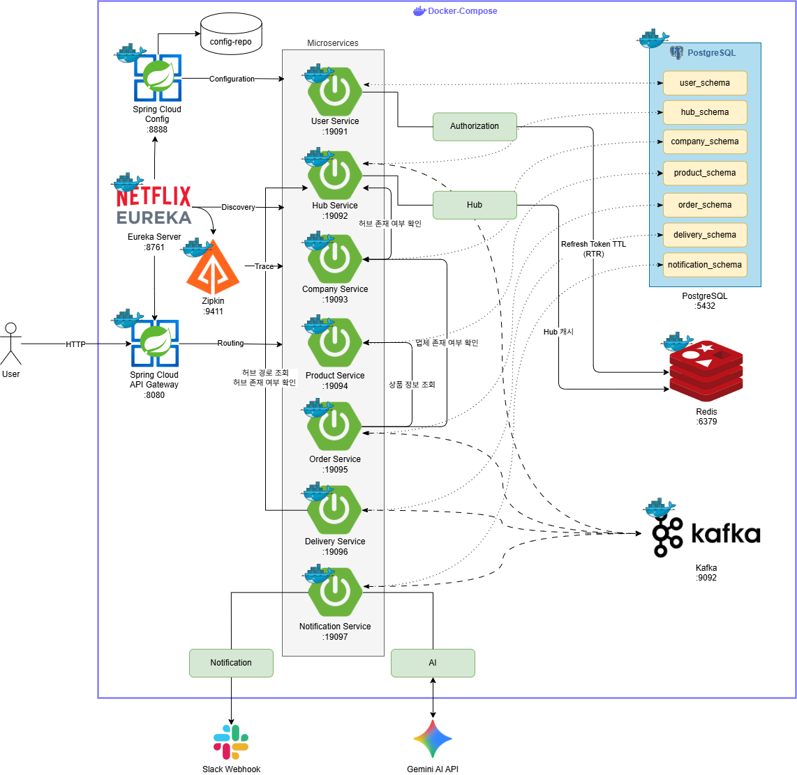
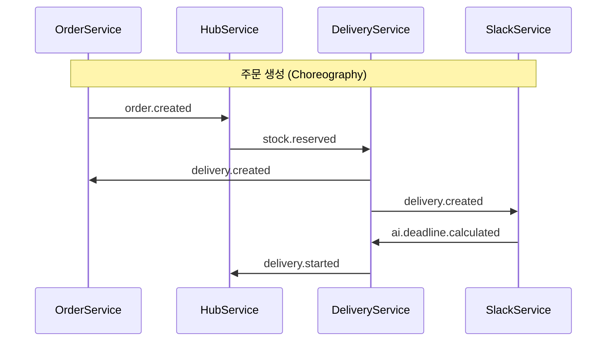
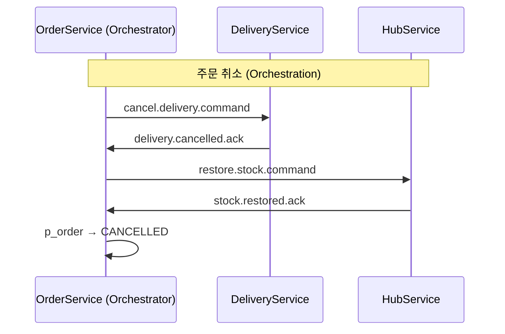

# sparta-logistics

> 주문 생성부터 배송 완료까지의 흐름을 Kafka 기반 Saga 패턴으로 처리하는 Spring Boot MSA 물류 관리 플랫폼 프로젝트입니다.

## 팀원 소개

| 프로필 | 이름 | 역할 및 담당 도메인 | GitHub |
| :---: | :---: | :--- | :---: |
|  | **김다은** | 인프라 & 사용자 | [](https://github.com/euneuneun) |
|  | **김승현** | 리더 & 허브 | [](https://github.com/swissmissed2) |
|  | **박준식** | 주문 | [](http://github.com/qkrwns1478) |
|  | **이다혜** | 업체 & 상품 | [](http://github.com/dahye1111) |
|  | **장하영** | 인프라 & Slack + AI | [](https://github.com/start-ha) |
|  | **조아영** | 배송 | [](http://github.com/look516) |

## 서비스 구성

| 서비스 | 역할 | 포트 |
|---|---|---|
| discovery-server | Eureka 서비스 디스커버리 | 8761 |
| config-server | 중앙 설정 관리 | 8888 |
| api-gateway | 라우팅, JWT 검증 | 8080 |
| user-service | 회원가입/로그인/사용자 관리 | 19091 |
| hub-service | 허브/재고/경로 관리 | 19092 |
| company-service | 업체 관리 | 19093 |
| product-service | 상품 관리 | 19094 |
| order-service | 주문 관리, 취소 오케스트레이터 | 19095 |
| delivery-service | 배송 생성/관리 | 19096 |
| slack-service | Slack 알림, AI 발송 시한 계산 | 19097 |

## 기술 스택

| 분류 | 기술                                                                                                                                                                                                                                                                                                                                 |
|---|------------------------------------------------------------------------------------------------------------------------------------------------------------------------------------------------------------------------------------------------------------------------------------------------------------------------------------|
| Language / Framework |    |
| Service Mesh |    |
| Messaging |                                                                                                                                                                                                        |
| Database |                                                                                                       |
| Observability |                                                                                                                                                                                                                                                         |
| Build |                                                                                                                                                                                                                        |

## 아키텍처 설계도

<details>
    <summary>더보기</summary>
    
</details>

## 문서

| 문서 | 내용 |
|---|---|
| [docs/SAGA.md](docs/SAGA.md) | Saga 패턴 의사결정, Kafka 토픽 전체 목록, 시퀀스 다이어그램 |
| [delivery-service/docs/](delivery-service/docs/) | 배송 서비스 API 명세, 아키텍처, 상태 머신, 권한 정책 등 |

---

## 실행 방법

### 1단계: 환경변수 설정

루트 디렉터리에 `.env` 파일을 생성합니다.

```dotenv
POSTGRES_USER=your_user
POSTGRES_PASSWORD=your_password
POSTGRES_DB=your_database
REDIS_HOST=localhost
REDIS_PORT=6379
KAFKA_BOOTSTRAP_SERVERS=localhost:9092
JWT_SECRET=your_jwt_secret
```

### 2단계: 인프라 기동

```bash
docker compose up -d
docker compose ps
```

정상 기동 시 `sparta-postgres`, `sparta-redis`, `sparta-zookeeper`, `sparta-kafka`, `sparta-zipkin` 이 모두 `running` 상태여야 합니다.

### 3단계: 서비스 기동

의존성 순서에 따라 기동합니다.

```
1. discovery-server
2. config-server
3. api-gateway
4. 비즈니스 서비스 (순서 무관)
   user-service, company-service, hub-service,
   product-service, order-service, delivery-service, slack-service
```

Gradle로 기동하는 경우:

```bash
./gradlew :discovery-server:bootRun &
./gradlew :config-server:bootRun &
./gradlew :api-gateway:bootRun &
./gradlew :order-service:bootRun &
# 나머지 서비스도 동일하게 실행
```

### 4단계: 기동 확인

| 확인 항목 | URL |
|---|---|
| Eureka 대시보드 (서비스 등록 확인) | http://localhost:8761 |
| API Gateway 헬스체크 | http://localhost:8080/actuator/health |
| Zipkin 분산 추적 | http://localhost:9411 |

---

## Saga 흐름 요약

주문 생성은 **Choreography Saga**, 주문 취소는 **Orchestration Saga** (Order Service 내장 오케스트레이터) 로 처리합니다.





자세한 Kafka 토픽 목록과 보상 트랜잭션 흐름은 [docs/SAGA.md](docs/SAGA.md)를 참고하세요.

## 권한 체계

| 역할 | 코드 | 설명 |
|---|---|---|
| 마스터 | `MASTER` | 전체 시스템 관리, 모든 CRUD 가능 |
| 허브 관리자 | `HUB_MANAGER` | 담당 허브 소속 데이터 관리 |
| 배송 담당자 | `DELIVERY_MANAGER` | 허브/업체 배송 담당 |
| 업체 담당자 | `COMPANY_MANAGER` | 소속 업체 정보 및 주문 관리 |

API 요청 시 Gateway가 JWT를 검증하고 `X-User-Id`, `X-User-Role` 헤더를 하위 서비스에 전달합니다.
