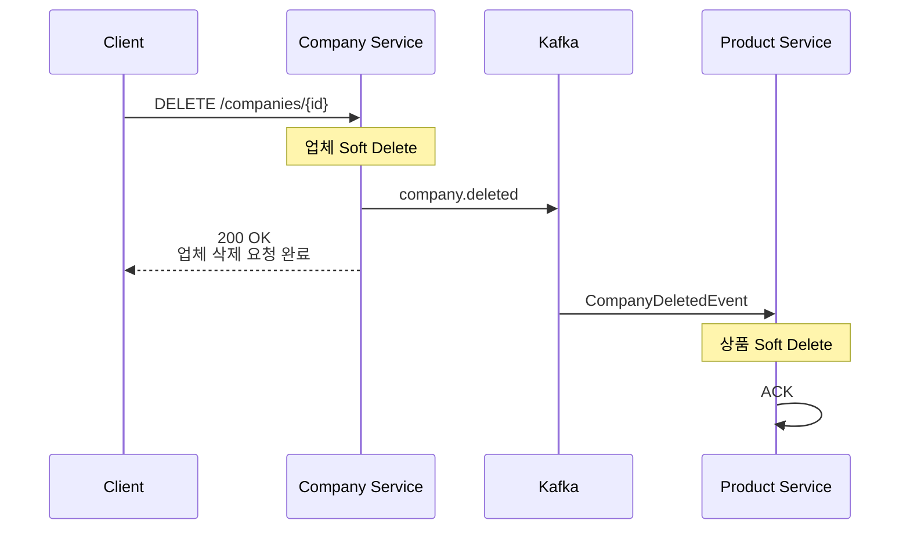
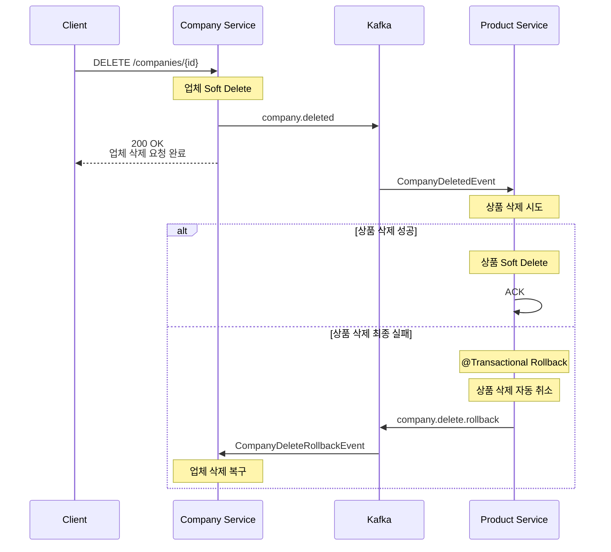
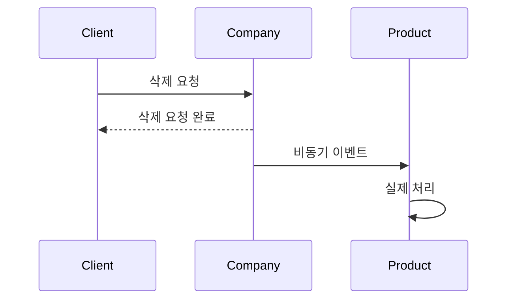

# Company Delete Saga

## 개요

업체 삭제는 Company Service와 Product Service 간 데이터 정합성을 유지하기 위해
Kafka 기반 Choreography Saga 패턴으로 구현하였습니다.

업체가 삭제되면 해당 업체에 속한 상품도 함께 삭제되어야 하지만,
MSA 환경에서는 서로 다른 서비스의 DB를 하나의 트랜잭션으로 묶을 수 없습니다.

따라서 Company Service는 업체를 Soft Delete한 뒤 이벤트를 발행하고,
Product Service가 이를 구독하여 상품 삭제를 수행합니다.

상품 삭제 과정에서 최종 실패가 발생하면
보상 이벤트(`company.delete.rollback`)를 발행하여
Company Service가 업체 삭제를 롤백합니다.

---

## Saga 패턴 의사결정

### 선택한 패턴

- 업체 삭제: **Choreography Saga**

### 선택 이유

업체 삭제 시나리오는 다음 두 서비스만 참여합니다.

```text
Company Service
    ↓
Product Service
```

서비스 수가 적고 흐름이 단순하기 때문에
중앙 오케스트레이터를 두는 Orchestration Saga보다
이벤트 기반 Choreography Saga가 적합하다고 판단했습니다.

또한 Company Service가 Product Service를 직접 호출하지 않고
이벤트만 발행하도록 설계하여 서비스 간 결합도를 낮출 수 있습니다.

---

## Kafka 토픽

| 토픽 | Publisher | Subscriber |
|--------|------------|------------|
| company.deleted | Company Service | Product Service |
| company.delete.rollback | Product Service | Company Service |

---

## Kafka 이벤트 DTO

```text
common/src/main/java/com/sparta/logistics/common/kafka/event/
├── CompanyDeletedEvent.java
└── CompanyDeleteRollbackEvent.java
```

### CompanyDeletedEvent

```java
private UUID companyId;
private UUID deletedBy;
private LocalDateTime deletedAt;
```

| 필드 | 설명 |
|--------|--------|
| companyId | 삭제된 업체 ID |
| deletedBy | 삭제 요청 사용자 |
| deletedAt | 삭제 시각 |

---

### CompanyDeleteRollbackEvent

```java
private UUID companyId;
private String reason;
```

| 필드 | 설명 |
|--------|--------|
| companyId | 복구 대상 업체 ID |
| reason | 롤백 사유 |

---

## 업체 삭제 Saga

### 정상 흐름



---

### 처리 단계

#### Step 1

Client가 업체 삭제 요청

```http
DELETE /companies/{id}
```

---

#### Step 2

Company Service

업체를 Soft Delete

```text
deletedAt 기록
deletedBy 기록
```

---

#### Step 3

CompanyDeletedEvent 발행

```text
topic = company.deleted
```

---

#### Step 4

Product Service

이벤트 수신 후 해당 업체의 상품 삭제

```text
deleteAllByCompanyId(companyId)
```

---

#### Step 5

정상 처리 완료

Kafka Offset Commit

---

## Saga 보상 트랜잭션

상품 삭제가 실패하면 보상 이벤트를 발행하여
업체 삭제를 롤백합니다.

### 실패 흐름



---

## Product Service 재시도 정책

Product Service Consumer는
Kafka ErrorHandler를 사용하여 재시도를 수행합니다.

```java
new FixedBackOff(1000L, 3)
```

| 항목 | 값 |
|--------|--------|
| 재시도 간격 | 1초 |
| 재시도 횟수 | 3회 |

---

### 최종 실패 시

```text
company.delete.rollback 발행
↓
DLQ 전송
```

---

## 데이터 정합성

### 업체

보상 이벤트 수신 시 복구

```text
deletedAt = null
deletedBy = null
```

---

### 상품

상품은 별도 보상 트랜잭션으로 복구하지 않습니다.

실제 구현에서는 Product Service Consumer 내부에서
상품 삭제가 수행되며,
예외 발생 시 트랜잭션 전체가 롤백됩니다.

```java
@Transactional
public void deleteAllByCompanyId(...)
```

따라서

```text
상품 삭제 성공
    → Commit

상품 삭제 실패
    → Rollback
```

이 되어 상품은 처음부터 삭제되지 않은 상태를 유지합니다.

즉,

```text
상품 복구 SQL 실행
❌ 없음

상품 롤백 이벤트
❌ 없음

@Transactional 자동 롤백
✅ 사용
```

---

## 응답 처리 정책

업체 삭제 API는 Saga 완료를 기다리지 않습니다.

```text
업체 삭제
↓
이벤트 발행
↓
즉시 응답
```

따라서 응답 시점에는 Product Service 처리가
아직 끝나지 않았을 수 있습니다.



이는 Choreography Saga의 일반적인 특성입니다.

본 프로젝트에서는 이러한 특성을 고려하여, 클라이언트가 최종 삭제 완료로 오해하지 않도록 응답 메시지를 다음과 같이 구성하였습니다.


## Eventually Consistency

현재 구현은 Eventually Consistent 모델을 따릅니다.

즉,

```text
일시적으로 데이터 상태가 다를 수 있음
↓
Saga 완료 후 최종 정합성 확보
```

따라서 사용자 응답도

```text
업체 삭제 완료
```

보다는

```text
업체 삭제 요청 완료
```

로 응답함으로써, 클라이언트에게 삭제 프로세스가 비동기로 진행 중임을 명확히 전달하도록 하였습니다.

---

## 개선 가능 사항

### Outbox Pattern

현재는 DB 커밋과 Kafka 발행이 하나의 트랜잭션으로 묶여 있지 않습니다.

```text
업체 삭제 성공
↓
Kafka 발행 실패
```

상황이 발생하면 이벤트 유실 가능성이 존재합니다.

이를 해결하기 위해 Outbox Pattern을 적용할 수 있습니다.

```text
Company 삭제
↓
Outbox 저장
↓
Commit
↓
Relay가 Kafka 발행
```

적용 시

- 이벤트 유실 방지
- At-Least-Once 발행 보장
- Kafka 장애 대응

이 가능해집니다.

현재 프로젝트에서는 일정상 적용하지 않았으며
향후 개선 사항으로 남겨두었습니다.
