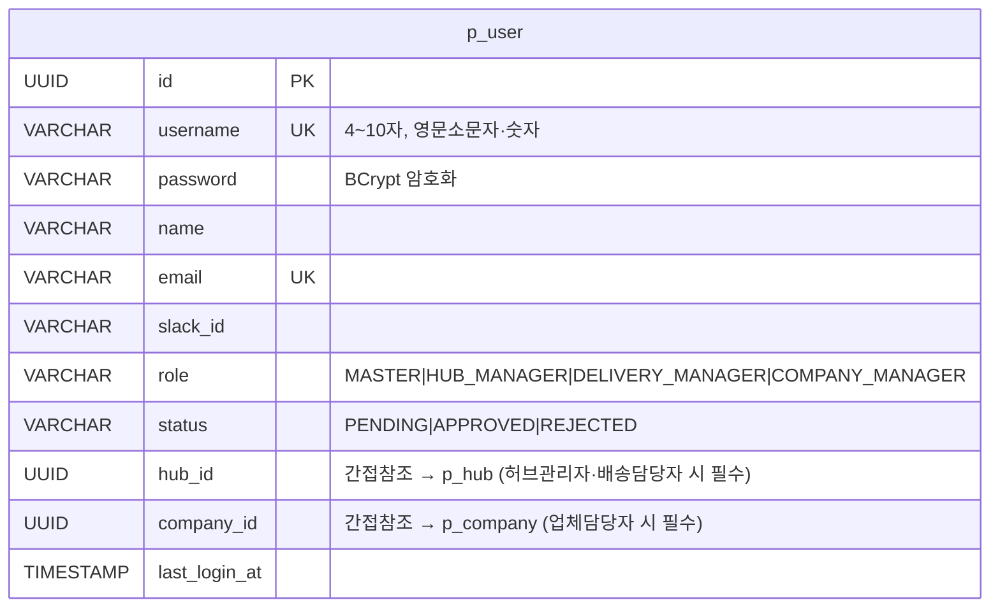
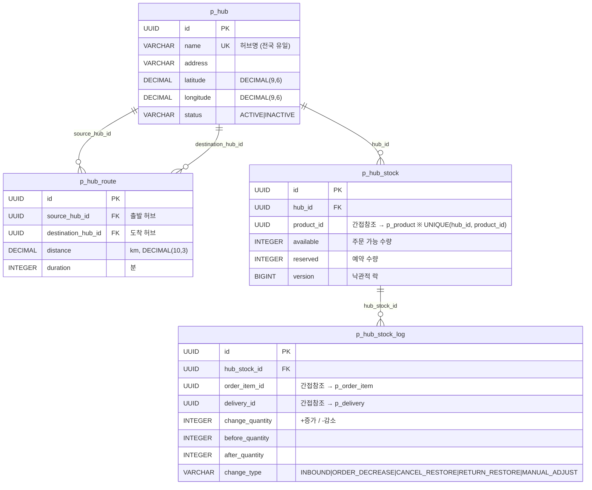
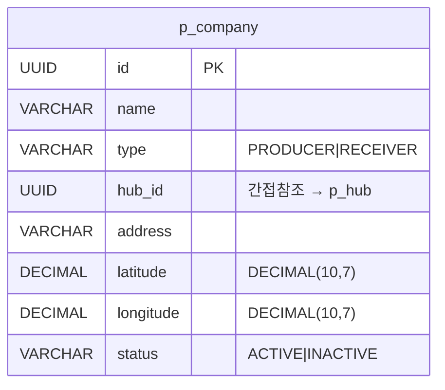
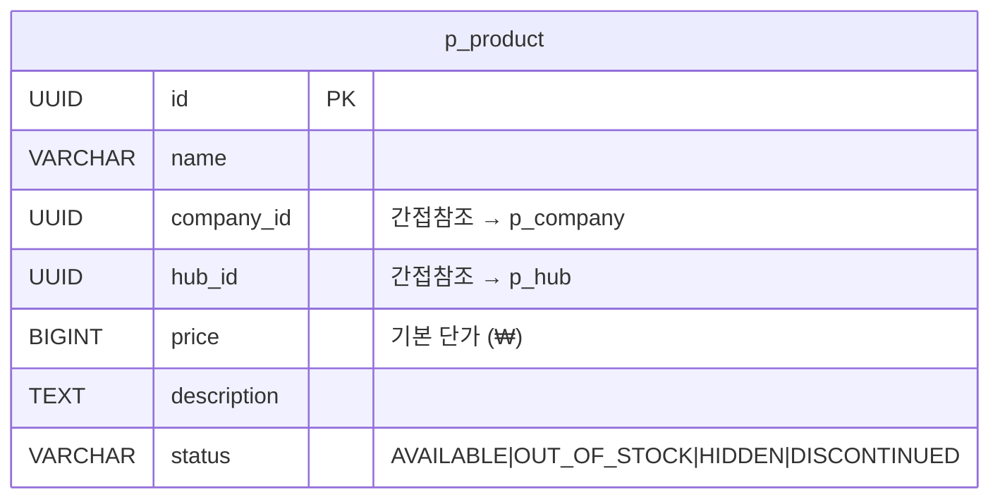
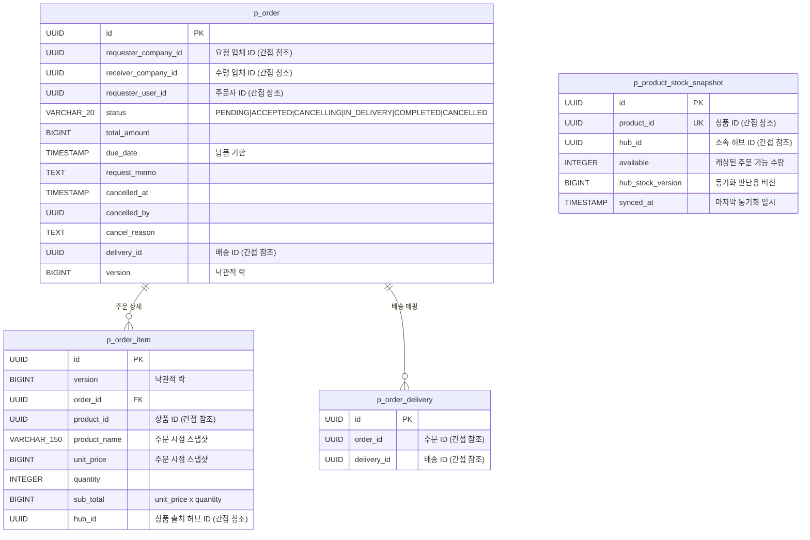
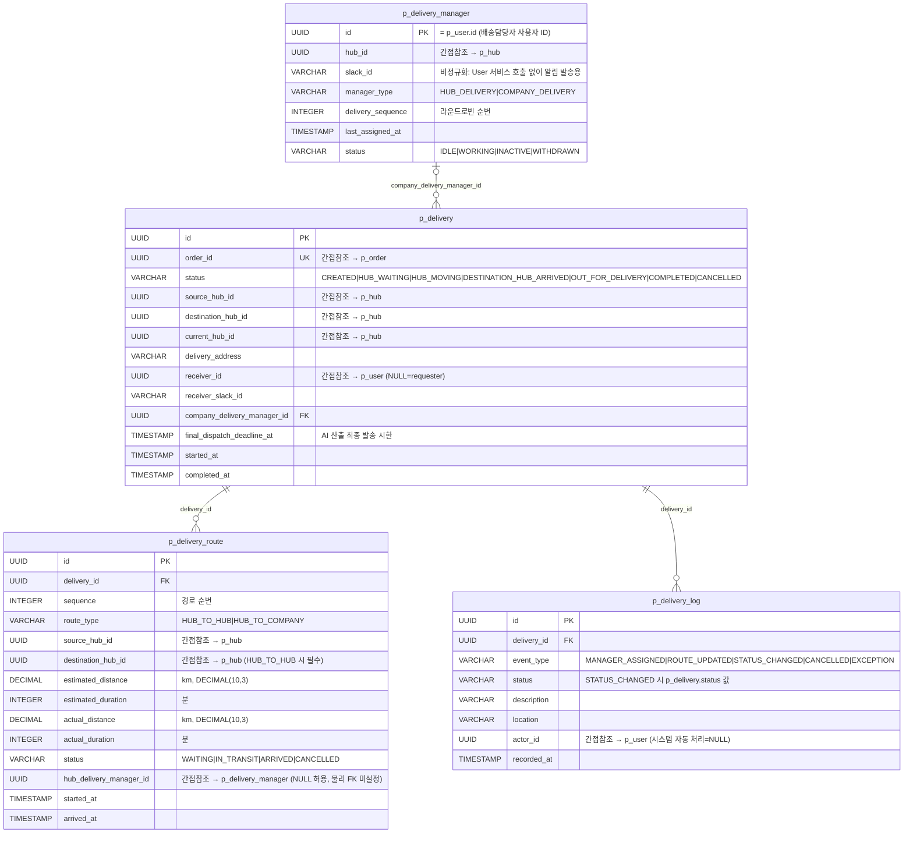
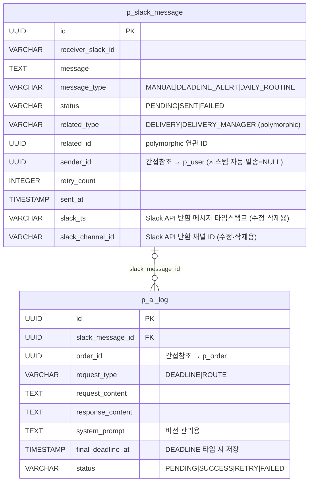

# ERD

> 서비스별 독립 DB 구조 (MSA)

## 목차

- [User Service](#user-service)
- [Hub Service](#hub-service)
- [Company Service](#company-service)
- [Product Service](#product-service)
- [Order Service](#order-service)
- [Delivery Service](#delivery-service)
- [Slack Service](#slack-service)
---

## User Service

---

## Hub Service

---

## Company Service

---

## Product Service

---

## Order Service

---

## Delivery Service

---

## Slack Service

