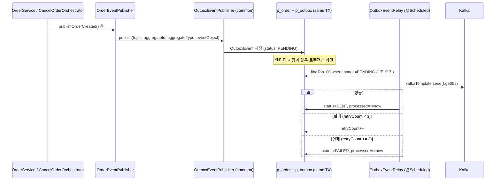
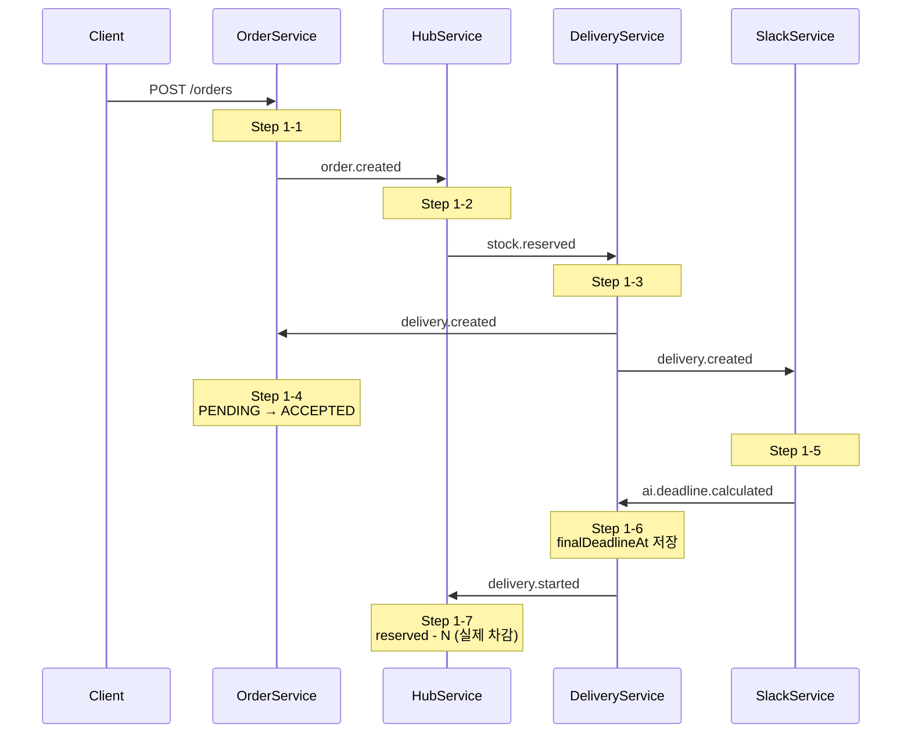
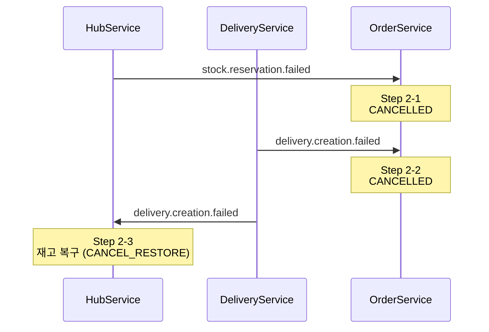
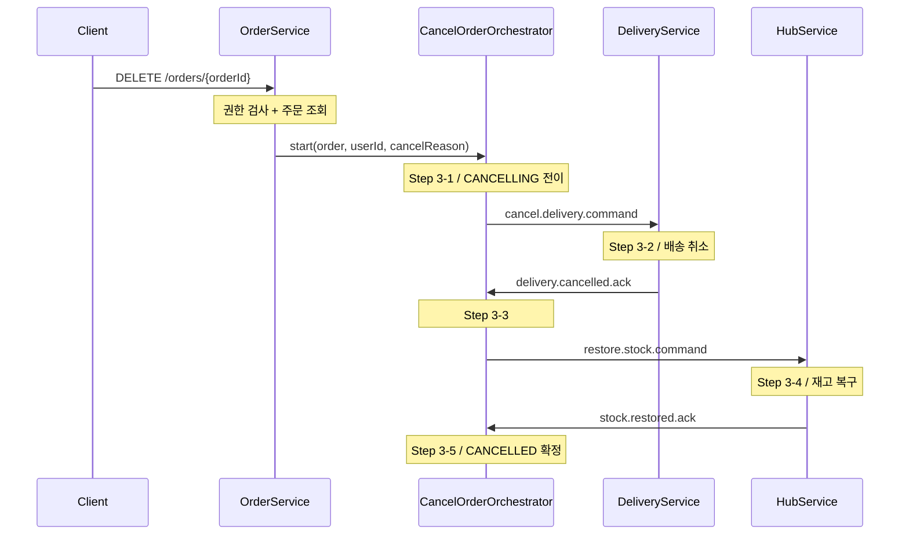
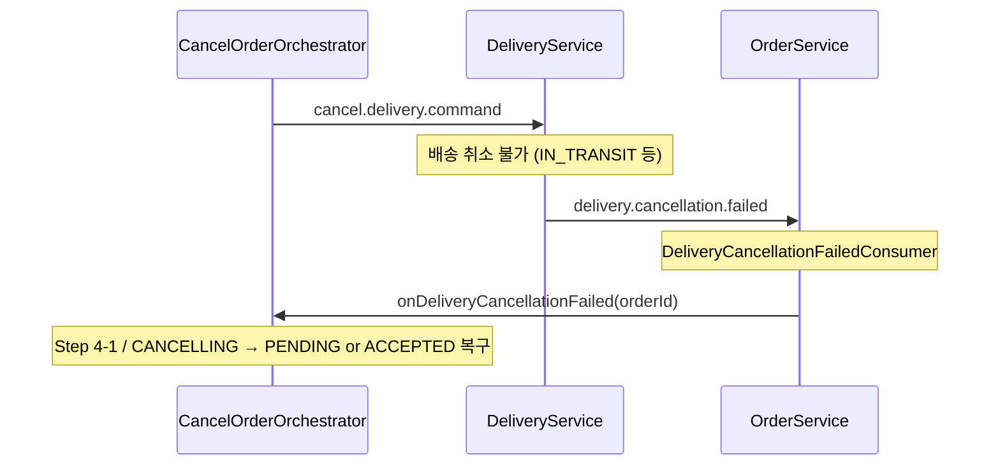
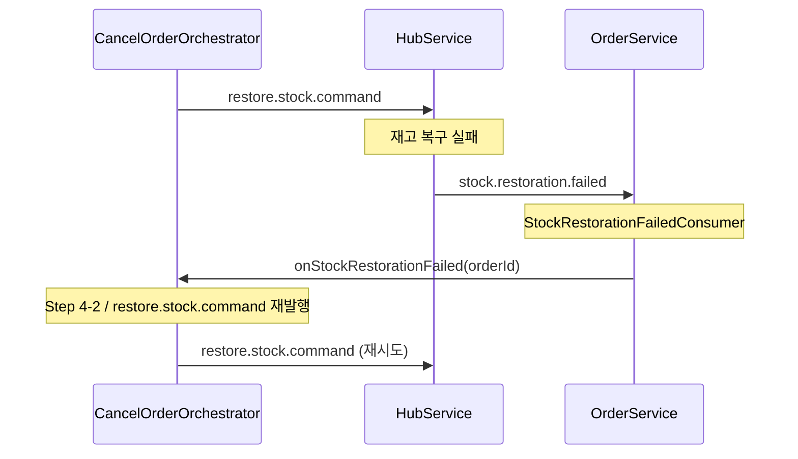
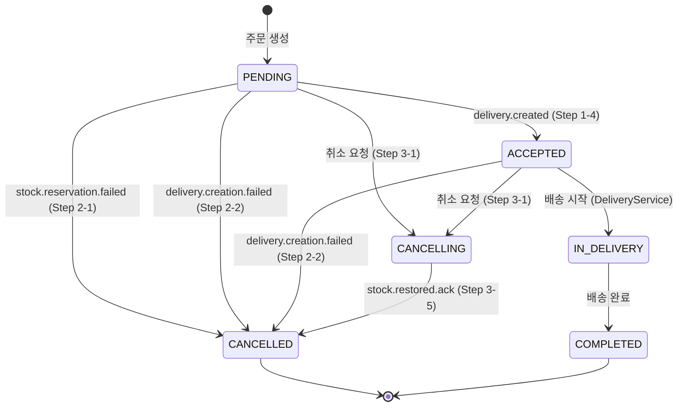

# Saga 패턴 의사결정

- **주문 생성**: Choreography Saga (Kafka 이벤트 체이닝)
- **주문 취소**: Orchestration Saga (Order 도메인의 Orchestrator)

---

## Kafka 토픽 전체 목록

| 토픽 | Publisher | Subscriber | 패턴 |
| --- | --- | --- | --- |
| `order.created` | OrderService | HubService | Choreography |
| `stock.reserved` | HubService | DeliveryService | Choreography |
| `stock.reservation.failed` | HubService | OrderService | Choreography 보상 |
| `delivery.created` | DeliveryService | OrderService, SlackService | Choreography |
| `delivery.creation.failed` | DeliveryService | HubService, OrderService | Choreography 보상 |
| `delivery.started` | DeliveryService | HubService | Choreography |
| `cancel.delivery.command` | OrderService (Orch.) | DeliveryService | Orchestration |
| `delivery.cancelled.ack` | DeliveryService | OrderService (Orch.) | Orchestration |
| `restore.stock.command` | OrderService (Orch.) | HubService | Orchestration |
| `stock.restored.ack` | HubService | OrderService (Orch.) | Orchestration |
| `hub.stock.updated` | HubService | OrderService | (스냅샷 동기화) |
| `ai.deadline.calculated` | SlackService | DeliveryService | Choreography |
| `delivery.cancellation.failed` | DeliveryService  |  OrderService (Orch.)  |  Orchestration 보상  |
| `stock.restoration.failed` | HubService  |  OrderService (Orch.)  |  Orchestration 보상  |
- 비고
    - [x]  파티션 키 도입 제안 ✅
        - Kafka는 같은 파티션 내에서 프로듀서가 보낸 순서를 보장합니다.
        - 파티션이 여러 개인 환경에서 순서가 중요한 이벤트가 있다면, 비즈니스 식별자를 파티션 키로 지정해야 합니다.
        - 같은 키를 가진 메시지는 항상 같은 파티션으로 라우팅되므로, `orderId`를 파티션 키로 쓰면 동일 주문의 이벤트가 컨슈머 측에서 순서대로 처리됩니다.
        - 배달의민족에서 `배차완료 → 픽업완료 → 배달완료` 순서 보장에 파티션 키를 활용한 사례를 확인했고, 이 프로젝트의 주문 Saga 이벤트와 배송 생명주기 이벤트에도 동일하게 적용할 수 있을 것 같습니다.

            | 이벤트 그룹 | 파티션 키 | 이유 |
            | --- | --- | --- |
            | 주문 Saga 이벤트
            `order.created`, `stock.reserved`, `stock.reservation.failed`, `cancel.delivery.command`, `restore.stock.command`, `delivery.cancelled.ack`, `stock.restored.ack` | `orderId` | 동일 주문 이벤트가 같은 파티션으로 수렴되어 Saga 체인 순서 보장 |
            | 배송 생명주기 이벤트
            `delivery.created`, `delivery.creation.failed`, `ai.deadline.calculated`, `delivery.started` | `deliveryId` | 배송 단위 순서를 주문 Saga와 독립적으로 보장 |

---

## Outbox 패턴

OrderService가 발행하는 모든 Kafka 이벤트는 직접 발행하지 않고 `p_outbox` 테이블을 경유합니다.
DB 커밋과 Kafka 발행을 분리하여, Kafka 장애 시에도 이벤트 유실 없이 at-least-once 발행을 보장합니다.

| 재시도 조건 | 동작 |
| --- | --- |
| 발행 성공 | `status=SENT`, `processedAt` 기록 |
| 발행 실패, retryCount < 3 | `retryCount++`, `status=PENDING` 유지 |
| 발행 실패, retryCount ≥ 3 | `status=FAILED`, 수동 확인 필요 |

- 비고
  - at-least-once 보장: 릴레이가 `SENT` 저장 전에 크래시하면 중복 발행 가능
    - 컨슈머 측 `eventId` dedup 테이블로 보완 (✅ 구현 완료)
  - FAILED 이벤트: 현재 로그만 기록
    - 운영 환경에서는 Slack 알림 또는 Dead Letter 토픽 연동으로 가시성 확보 가능

---

## [Choreography Saga] 주문 생성

### [Step 1-1] `order.created` 발행

| 항목 | 내용 |
| --- | --- |
| 서비스 | **OrderService** |
| 진입점 | `OrderService.createOrder()` |
| 발행 토픽 | `order.created` |
| 파티션 키 | `orderId` |
| 처리 내용 | Order + OrderItem 생성(PENDING), `OrderCreatedEvent`를 Outbox 테이블에 저장 (릴레이가 Kafka 발행) |
| 이벤트 주요 필드 | `orderId`, `orderItems[]{orderItemId, productId, quantity, hubId}`, `requesterCompanyId`, `receiverCompanyId` |
| 다음 단계 | Step 1-2: HubService 재고 예약 |

### [Step 1-2] `order.created` 구독 → `stock.reserved` / `stock.reservation.failed` 발행

| 항목 | 내용 |
| --- | --- |
| 서비스 | **HubService** |
| 구독 토픽 | `order.created` |
| 처리 내용 | `orderItems` 순회하여 각 상품 재고 확인, 분산 락으로 `available` 차감 + `reserved` 증가 |
| 성공 시 발행 | `stock.reserved` (`orderId`, `destinationHubId`, `orderItems[]{productId, reservedQuantity, sourceHubId}`) |
| 실패 시 발행 | `stock.reservation.failed` (`orderId`, `productId`, `reason`) |
| 파티션 키 | `orderId` |
| 다음 단계 (성공) | Step 1-3: DeliveryService 배송 생성 |
| 다음 단계 (실패) | Step 2-1: OrderService 보상 취소 |
- 비고
    - HubService가 `order.created`를 수신하면 재고를 예약하는 것과는 별개로 실제 재고 차감을 어느 시점에서 할 지는 SA 문서 상에 명시되지 않았습니다.
        - [x]  `delivery.started` 토픽을 추가합니다. ✅
            - `delivery.started` 수신 전 (reserved 보유 중): `reserved - N`, `available + N`
            - `delivery.started` 수신 후 (실제 차감 완료): `available + N`만 복구

### [Step 1-3] `stock.reserved` 구독 → `delivery.created` / `delivery.creation.failed` 발행

| 항목 | 내용 |
| --- | --- |
| 서비스 | **DeliveryService** |
| 구독 토픽 | `stock.reserved` |
| 처리 내용 | Hub Route 조회, `Delivery` + `DeliveryRoute` 생성, 배송 담당자 배정(미배정 시 null 허용) |
| 성공 시 발행 | `delivery.created` (`deliveryId`, `orderId`, `sourceHubId`, `destinationHubId`, `companyDeliveryManagerId`) |
| 실패 시 발행 | `delivery.creation.failed` (`orderId`, `deliveryId`, `reason`, `itemsToRestore[]{orderItemId, productId, hubId, quantity}`) |
| 파티션 키 | `deliveryId` (성공) / `orderId` (실패) |
| 다음 단계 (성공) | Step 1-4: OrderService ACCEPTED 전이, Step 1-5: SlackService AI 시한 계산 |
| 다음 단계 (실패) | Step 2-2: OrderService 보상 취소, Step 2-3: HubService 재고 복구 |
- 비고
    - DeliveryService는 출발 허브별로 배송을 1건하면 하나의 `orderId`에 대해 `delivery.created`가 N번 발행될 수 있는 구조인데 몇 번째 이벤트를 받았을 때 주문을 `ACCEPTED`로 전이해야 할까요? ✅
        - [ ]  첫 번째 `delivery.created` 수신 즉시 ACCEPTED ❌
            - 나머지 배송 생성이 실패해도 ACCEPTED 유지됩니다
        - [x]  `DeliveryCreatedEvent`에 `totalDeliveryCount` 필드 추가하고 수신 수가 해당 값에 도달하면 ACCEPTED ⭕
            - OrderService에 주문-배송 매핑 테이블(`p_order_delivery`) 추가해야 합니다
        - [ ]  DeliveryService가 N건 생성 완료 후 단일 집계 이벤트를 별도 발행 ❌
            - 토픽을 추가해야 하고 집계 로직도 구현해야 합니다
    - 현재 선형 구조인데 해당 로직처럼 여러 개의 배송 건이 합쳐지게 된다면 delivery쪽에서는 이벤트 유실 (정합성) 문제가 생길 수도 있을 것 같다는 생각이 듭니다. 때문에 outbox 패턴을 적용할까 고려중인데 학습비용때문에 고민입니다. 혹시 다른 도메인에서는 어떻게 처리하실 예정이신가요?
        - 두 가지 케이스가 있습니다.
            1. N건 배송 생성 도중 크래시: N건을 단일 트랜잭션으로 묶으면 DB에 일부만 저장되는 문제를 피할 수 있습니다.
            2. DB 저장은 됐는데 Kafka 발행 실패하는 경우: 해결하려면 DB에 `p_outbox` 테이블을 추가해야 합니다.
        - Hub와 Order에서도 같은 문제가 발생할 수 있기 때문에 따로따로 Outbox 패턴을 구현하는 것보다는 공통 모듈로 한꺼번에 적용하는 쪽이 더 효율적으로 보입니다.
        - 일단 기능 구현을 1차 목표로 **단일 트랜잭션 + Kafka 실패 시 retry** 방향으로 구현하였습니다. 컨슈머 측 중복 처리 방지는 **상태 머신 가드(✅ 구현 완료)** 와 **`event_id` 기반 처리 완료 테이블(✅ 구현 완료)** 로 대응하고 있습니다.
            - 상태 전이 연산 (PENDING→ACCEPTED, CANCELLING→CANCELLED 등)은 상태 가드(no-op)로 중복 수신을 막을 수 있어 dedup 테이블 없이도 안전합니다.
            - 누적 연산 (재고 차감 `reserved - N` 등)은 동일 이벤트가 두 번 처리되면 이중 차감이 발생하므로, 진정한 멱등성을 위해 `event_id` 기반 처리 완료 테이블을 도입하였습니다. (✅ 구현 완료)
        - Debezium을 사용한 CDC 인프라까지 구성하는 것은 오버스펙

### [Step 1-4] `delivery.created` 구독 → 주문 ACCEPTED 전이

| 항목 | 내용 |
| --- | --- |
| 서비스 | **OrderService** |
| 컨슈머 | `DeliveryCreatedConsumer` |
| 구독 토픽 | `delivery.created` |
| 위임 메서드 | `OrderService.acceptOrder()` |
| 처리 내용 | 주문 상태 PENDING → ACCEPTED, `deliveryId` 저장 |
| 멱등성 | ✅ 상태 가드: PENDING이 아닌 경우 no-op / ✅ event_id dedup 테이블: 구현 완료 |
- 비고
    - 동시성 제어
        - CANCELLING 상태 키가 존재하면 이벤트를 skip합니다. Orchestration Saga 취소가 진행 중인 상태에서 `delivery.created`가 수신되어 ACCEPTED로 잘못 전이되는 경합을 방지합니다.
        - 처리 시작 전 PROCESSING 상태 키를 세팅합니다. 처리 중 `cancelOrder()` HTTP 요청이 `ORDER_PROCESSING_IN_PROGRESS`로 차단됩니다.
        - `acceptOrder()` 완료 후 주문이 PENDING/ACCEPTED 상태이므로 취소 요청이 정당합니다. 따라서 처리 완료 즉시 PROCESSING 키를 해제합니다(try-finally). 보상 Consumer 두 종과 달리 명시적 해제가 필요한 이유는, `cancelOrderByCompensation()` 이후 주문은 어차피 CANCELLED가 되어 취소 요청 자체가 불가능한 것과 다르기 때문입니다.

### [Step 1-5] `delivery.created` 구독 → AI 발송 시한 계산 → `ai.deadline.calculated` 발행

| 항목 | 내용 |
| --- | --- |
| 서비스 | **SlackService (NotificationService)** |
| 구독 토픽 | `delivery.created` |
| 처리 내용 | AI API 호출로 `finalDeadlineAt` 산출, Slack 알림 발송 |
| 발행 토픽 | `ai.deadline.calculated` (`deliveryId`, `orderId`, `finalDeadlineAt`) |
| 파티션 키 | `deliveryId` |
| 다음 단계 | Step 1-6: DeliveryService `finalDeadlineAt` 저장 |

### [Step 1-6] `ai.deadline.calculated` 구독 → `finalDeadlineAt` 저장 → `delivery.started` 발행

| 항목 | 내용 |
| --- | --- |
| 서비스 | **DeliveryService** |
| 구독 토픽 | `ai.deadline.calculated` |
| 처리 내용 | 해당 Delivery에 `finalDeadlineAt` 저장 후 `delivery.started` 발행 |
| 발행 토픽 | `delivery.started` (`deliveryId`, `orderId`, `orderItems[]{orderItemId, productId, hubId, quantity}`) |
| 파티션 키 | `deliveryId` |
| 다음 단계 | Step 1-7: HubService 실제 재고 차감 |

### [Step 1-7] `delivery.started` 구독 → 실제 재고 차감

| 항목 | 내용 |
| --- | --- |
| 서비스 | **HubService** |
| 구독 토픽 | `delivery.started` |
| 처리 내용 | `orderItems` 순회하여 각 상품 `reserved - N`, `HubStockChangeType.DELIVERY_STARTED` 이력 기록 |
| 파티션 키 | `deliveryId` |
| 비고 | `HubStockChangeType`에 `DELIVERY_STARTED` 타입 추가 필요 |
- 비고
    - [x]  `delivery.start` 의 파티션 키를 무엇으로 해야 할까요? ✅
        - [ ]  `orderId` ❌
            - 재고 차감이 주문 흐름의 연장선이므로 주문 Saga 이벤트 그룹에 둬야 합니다.
            - 재고 처리까지 생각하면 주문에 이어지는 이벤트입니다.
        - [x]  `deliveryId` ⭕
            - 파티션 키는 '어떤 도메인의 이벤트인가'가 아니라 '같은 파티션 안에서 순서를 보장해야 하는 이벤트가 무엇인가'로 결정해야 합니다.
            - N개 허브 주문에서 `delivery.started`가 N번 발행될 때 `orderId`를 쓰면 같은 파티션에 몰려 불필요한 직렬화가 발생할 수 있습니다.

---

## [Choreography Saga] 주문 생성 보상 트랜잭션

### [Step 2-1] `stock.reservation.failed` 구독 → 주문 CANCELLED

| 항목 | 내용 |
| --- | --- |
| 서비스 | **OrderService** |
| 컨슈머 | `StockReservationFailedConsumer` |
| 구독 토픽 | `stock.reservation.failed` |
| 위임 메서드 | `OrderService.cancelOrderByCompensation()` |
| 처리 내용 | 주문 즉시 CANCELLED, `cancelReason` = 실패 사유 |
| 멱등성 | ✅ 상태 가드: 이미 CANCELLED인 경우 no-op / ✅ event_id dedup 테이블: 구현 완료 |
- 비고
    - 동시성 제어
        - CANCELLING 상태 키가 존재하면 이벤트를 skip합니다. Orchestration Saga 취소가 이미 진행 중인 경우 Choreography 보상 취소가 중복으로 실행되지 않도록 방지합니다.
        - 처리 시작 전 PROCESSING 상태 키를 세팅합니다. `cancelOrderByCompensation()` 완료 후 주문이 CANCELLED 상태가 되므로 PROCESSING 키는 TTL(30초) 자동 만료에 위임합니다.

### [Step 2-2] `delivery.creation.failed` 구독 → 주문 CANCELLED

| 항목 | 내용 |
| --- | --- |
| 서비스 | **OrderService** |
| 컨슈머 | `DeliveryCreationFailedConsumer` |
| 구독 토픽 | `delivery.creation.failed` |
| 위임 메서드 | `OrderService.cancelOrderByCompensation()` |
| 처리 내용 | 주문 즉시 CANCELLED, `cancelReason` = 실패 사유 |
| 멱등성 | ✅ 상태 가드: 이미 CANCELLED인 경우 no-op / ✅ event_id dedup 테이블: 구현 완료 |
- 비고
    - 동시성 제어
        - Step 2-1과 동일한 패턴: CANCELLING 상태 키 존재 시 skip, 이외엔 PROCESSING 세팅 후 처리합니다. PROCESSING 키는 TTL 자동 만료에 위임합니다.

### [Step 2-3] `delivery.creation.failed` 구독 → 재고 예약 복구

| 항목 | 내용 |
| --- | --- |
| 서비스 | **HubService** |
| 구독 토픽 | `delivery.creation.failed` |
| 처리 내용 | `releaseReservation()` 호출로 `reserved` 차감 + `available` 복구, `HubStockChangeType.CANCEL_RESTORE` 이력 기록 |
| 비고 | Step 2-2와 동일한 토픽을 구독 |

---

## [Orchestration Saga] 주문 취소

### `CancelOrderOrchestrator`

| 항목 | 내용 |
| --- | --- |
| 역할 | Orchestration Saga 중앙 조율자 |
| 의존성 | `OrderRepository`, `OrderEventPublisher` |
| 메서드 | `start(Order, UUID, String)` / `onDeliveryCancelled(UUID)` / `onStockRestored(UUID)` / `onDeliveryCancellationFailed(UUID)` / `onStockRestorationFailed(UUID)` |
| 트랜잭션 | 메서드별 `@Transactional` (각 단계 독립 트랜잭션) |
| 멱등성 전략 | 주문 없음 → warn 후 no-op / CANCELLING 아님 → warn 후 no-op |
| 커맨드 식별 | 발행 시 `eventId = UUID.randomUUID()` 부여 |
| 파티션 키 | 모든 발행에 `orderId` 사용 → 동일 주문의 명령 순서 보장 |
- 비고
    - 설계 초기에는 Orchestration Saga 패턴이 주문 취소 한 군데에만 적용되기 때문에 Orchestrator 컴포넌트 추가 없이 OrderService에서 조율자 역할을 하는 것으로 되어 있었습니다.
    - 이후 OrderService가 비대해지자 비즈니스 책임을 명확히 하기 위해 Orchestrator를 따로 구현하였습니다.

### [Step 3-1] `cancel.delivery.command` 발행

| 항목 | 내용 |
| --- | --- |
| 서비스 | **OrderService** |
| 담당 컴포넌트 | `CancelOrderOrchestrator.start()` |
| 진입점 | `OrderService.cancelOrder()` → `CancelOrderOrchestrator.start()` |
| 발행 토픽 | `cancel.delivery.command` |
| 파티션 키 | `orderId` |
| 처리 내용 | 주문 상태 → CANCELLING, `cancelledBy` 및 `cancelReason` 기록, 커맨드를 Outbox 테이블에 저장 (릴레이가 Kafka 발행) |
| 이벤트 주요 필드 | `orderId`, `deliveryId` |
| 전이 가능 상태 | PENDING, ACCEPTED (IN_DELIVERY 이상은 `ORDER_NOT_CANCELLABLE` 예외) |
| 권한 검사 | `OrderService.cancelOrder()`에서 MASTER/HUB_MANAGER 여부 및 허브 담당 검사 후 위임 |
| 다음 단계 | Step 3-2: DeliveryService 배송 취소 |
- 비고
    - CANCELLING 상태 키 생명 주기
        - 검증(권한·상태·허브)을 통과한 후에 CANCELLING 상태 키를 세팅합니다. 검증 실패 시 키가 남지 않도록 세팅 시점을 검증 통과 이후로 이동하였습니다.
        - CANCELLING 상태 키는 Saga 완료(Step 3-5 `confirmOrderCancelled()`) 또는 복구(Step 4-1 `handleDeliveryCancellationFailed()`) 시점에 해제됩니다. 기존에는 `cancelOrder()` 반환 직후 해제되어 이후 Kafka Consumer가 키를 확인할 수 없었습니다.
    - [x]  배송 취소 명령(`cancel.delivery.command`)을 수신했을 때, 배송이 **이미 이동 중(HUB_MOVING 이후**)이라면? ✅

        - 현재 `DeliveryStatus` 상태 전이에서는 모든 진행 상태에서 CANCELLED 전이를 허용하고 있으나, 재고 복구 방식이 **허브에서 출발 전인지, 후인지**로 달라지기 때문에 정책 결정이 필요합니다.
        - [x]  출발 전(HUB_WAITING 이전)만 취소 허용 ⭕
            - 상태에서 `HUB_MOVING` 이후 → `CANCELLED` 전이를 차단
            - 배송 중 취소 요청은 `INVALID_STATUS_FOR_CANCEL` 에러 반환 후 CS 수동 처리 가정
        - [ ]  전 상태 취소 허용 + ack에 상태 정보 포함 ❌
            - 취소를 모든 상태에서 허용하되, `delivery.cancelled.ack`에 `cancelledAtStatus` 필드 추가
            - OrderService가 이를 보고 `restore.stock.command`의 복구 타입을 결정

### [Step 3-2] `cancel.delivery.command` 구독 → `delivery.cancelled.ack` 발행

| 항목 | 내용 |
| --- | --- |
| 서비스 | **DeliveryService** |
| 구독 토픽 | `cancel.delivery.command` |
| 처리 내용 | 배송 상태 확인 후 취소 처리 (`PENDING`/`ACCEPTED` → 취소 가능, `IN_TRANSIT` 이상 → 취소 불가) |
| 성공 시 발행 | `delivery.cancelled.ack` (`deliveryId`, `orderId`) |
| 실패 시 발행 | `delivery.cancellation.failed` (`orderId`, `deliveryId`, `reason`) |
| 파티션 키 | `orderId` |
| 다음 단계 (성공) | Step 3-3: OrderService `restore.stock.command` 발행 |
| 다음 단계 (실패) | Step 4-1: OrderService CANCELLING → 이전 상태 복구 |

### [Step 3-3] `delivery.cancelled.ack` 구독 → `restore.stock.command` 발행

| 항목 | 내용 |
| --- | --- |
| 서비스 | **OrderService** |
| 담당 컴포넌트 | `CancelOrderOrchestrator.onDeliveryCancelled()` |
| 컨슈머 | `DeliveryCancelledAckConsumer` |
| 구독 토픽 | `delivery.cancelled.ack` |
| 위임 메서드 | `OrderService.handleDeliveryCancelled()` → `CancelOrderOrchestrator.onDeliveryCancelled()` |
| 발행 토픽 | `restore.stock.command` |
| 파티션 키 | `orderId` |
| 처리 내용 | `OrderItem` 목록으로 복구 대상 상품·수량 구성 후 재고 복구 커맨드를 Outbox 테이블에 저장 (릴레이가 Kafka 발행) |
| 이벤트 주요 필드 | `orderId`, `orderItems[]{orderItemId, productId, hubId, quantity}` |
| 멱등성 | ✅ 상태 가드: CANCELLING이 아닌 경우 no-op / ✅ event_id dedup 테이블: 구현 완료 |
| 다음 단계 | Step 3-4: HubService 재고 복구 |

### [Step 3-4] `restore.stock.command` 구독 → `stock.restored.ack` 발행

| 항목 | 내용 |
| --- | --- |
| 서비스 | **HubService** |
| 구독 토픽 | `restore.stock.command` |
| 처리 내용 | `orderItems` 순회하여 각 상품 `reserved` 차감 + `available` 복구, `HubStockChangeType.CANCEL_RESTORE` 이력 기록 |
| 성공 시 발행 | `stock.restored.ack` (`orderId`) |
| 실패 시 발행 | `stock.restoration.failed` (`orderId`, `reason`) |
| 파티션 키 | `orderId` |
| 다음 단계 (성공) | Step 3-5: OrderService CANCELLED 확정 |
| 다음 단계 (실패) | Step 4-2: OrderService `restore.stock.command` 재발행 |

### [Step 3-5] `stock.restored.ack` 구독 → 주문 CANCELLED 확정

| 항목 | 내용 |
| --- | --- |
| 서비스 | **OrderService** |
| 담당 컴포넌트 | `CancelOrderOrchestrator.onStockRestored()` |
| 컨슈머 | `StockRestoredAckConsumer` |
| 구독 토픽 | `stock.restored.ack` |
| 위임 메서드 | `OrderService.confirmOrderCancelled()` → `CancelOrderOrchestrator.onStockRestored()` |
| 처리 내용 | 주문 상태 CANCELLING → CANCELLED, `cancelledAt` 기록 |
| 멱등성 | ✅ 상태 가드: CANCELLING이 아닌 경우 no-op / ✅ event_id dedup 테이블: 구현 완료 |
| 비고 | `cancelledBy` 및 `cancelReason`은 Step 3-1에서 이미 저장되었으므로 기록하지 않음. Orchestration Saga 완료 시점에 CANCELLING 상태 키를 해제함 |

---

## [Orchestration Saga] 주문 취소 보상 트랜잭션

취소 흐름에서 외부 서비스가 실패할 수 있는 단계는 두 곳입니다.

| 실패 단계 | 실패 시 이미 완료된 것 | 보상 방향 |
| --- | --- | --- |
| Step 3-2: 배송 취소 거부 | 없음 | 주문 `CANCELLING` → 이전 상태(`PENDING`/`ACCEPTED`) 복구 |
| Step 3-4: 재고 복구 실패 | 배송 취소 완료 | `restore.stock.command` 재발행 (재시도) |

### Step 3-2 실패 (배송 취소 거부)

### [Step 4-1] `delivery.cancellation.failed` 구독 → 주문 이전 상태 복구

| 항목 | 내용 |
| --- | --- |
| 서비스 | **OrderService** |
| 담당 컴포넌트 | `CancelOrderOrchestrator.onDeliveryCancellationFailed()` |
| 컨슈머 | `DeliveryCancellationFailedConsumer` |
| 구독 토픽 | `delivery.cancellation.failed` |
| 처리 내용 | `CANCELLING` → 이전 상태 복구, `cancelledBy` 및 `cancelReason` 초기화 |
| 이전 상태 판별 | `deliveryId == null ? PENDING : ACCEPTED`  |
| 멱등성 | ✅ 상태 가드: CANCELLING이 아닌 경우 no-op / ✅ event_id dedup 테이블: 구현 완료 |
| 비고 | 이 시점에서 재고·배송 모두 변경된 것이 없으므로 주문 상태만 복구하면 됨. 복구 완료 시 CANCELLING 상태 키를 해제하여 이후 `delivery.created` 등 Consumer 이벤트가 정상 처리될 수 있도록 함 |

### Step 3-4 실패 (재고 복구 실패)

### [Step 4-2] `stock.restoration.failed` 구독 → `restore.stock.command` 재발행

| 항목 | 내용 |
| --- | --- |
| 서비스 | **OrderService** |
| 담당 컴포넌트 | `CancelOrderOrchestrator.onStockRestorationFailed()` |
| 컨슈머 | `StockRestorationFailedConsumer` |
| 구독 토픽 | `stock.restoration.failed` |
| 처리 내용 | Redis 재시도 카운터 증가 → 한도(`MAX_RESTORE_RETRY = 3`) 이내이면 `restore.stock.command`를 Outbox 테이블에 저장 (릴레이 재발행), 초과 시 중단 후 `log.warn` |
| 멱등성 | ✅ 상태 가드: CANCELLING이 아닌 경우 no-op / ⏳ event_id dedup 테이블: 미구현 |
| 비고 | 재고 복구는 `reserved` 차감 + `available` 증가로 멱등 연산이므로 재시도 안전 이 시점에서 배송 취소는 이미 완료되어 원복 불가 재시도 카운터는 Saga 정상 완료(`onStockRestored`) 또는 배송 취소 실패 복구(`onDeliveryCancellationFailed`) 시 삭제됨 |

- 비고
    - 재시도 한도 초과 또는 이벤트 유실로 주문이 `CANCELLING`에 고착될 수 있습니다.
        - `CancellingSagaTimeoutChecker`가 30분 이상 고착된 주문을 5분 주기로 감지해 `log.warn`을 남깁니다.
        - 자동 복구는 없으며 운영자가 원인을 확인 후 수동 처리해야 합니다.
    - 자동 복구가 없는 이유
        - 인프라 장애인지 로직 버그인지 코드가 판단할 수 없기 때문입니다.
        - 자동으로 PENDING/ACCEPTED로 되돌리면, 원인이 로직 버그일 때 취소 요청이 유실된 채 주문이 살아나는 상황이 생깁니다.
        - 반대로 CANCELLED로 강제 확정하면, 실제로 재고가 복구되지 않은 상태에서 주문이 닫힐 수 있습니다.
        - 두 경우 모두 데이터 정합성 문제로 이어지므로 관리자가 원인을 보고 결정해야 합니다.
    - 미결 사항
        - 현재 타임아웃 감지 시 `log.warn`만 남기며, 별도 알림 채널이 없습니다.
        - 누군가 로그를 직접 확인하지 않으면 고착 상태를 인지할 수 없습니다.
        - 로그 모니터링 시스템 알람, Dead Letter Topic (`cancelling.timeout`) 발행, Slack 알림 등의 방안이 있지만 현재 일정 상 구현이 어렵습니다.

---

## 주문 상태 전이

| 현재 상태 | 전이 후 상태 | 조건 |
| --- | --- | --- |
| `PENDING` | `ACCEPTED` | `delivery.created` 수신 (Step 1-4) |
| `PENDING` | `CANCELLED` | `stock.reservation.failed` 수신 (Step 2-1) |
| `PENDING` | `CANCELLED` | `delivery.creation.failed` 수신 (Step 2-2) |
| `PENDING` | `CANCELLING` | 취소 요청 (MASTER/HUB_MANAGER, Step 3-1) |
| `ACCEPTED` | `IN_DELIVERY` | 배송 시작 (DeliveryService 외부 이벤트) |
| `ACCEPTED` | `CANCELLED` | `delivery.creation.failed` 수신 (Step 2-2) |
| `ACCEPTED` | `CANCELLING` | 취소 요청 (MASTER/HUB_MANAGER, Step 3-1) |
| `CANCELLING` | `CANCELLED` | `stock.restored.ack` 수신 (Step 3-5) |
| `IN_DELIVERY` 이상 | 취소 불가 | `ORDER_NOT_CANCELLABLE` 예외 |

※ `CANCELLING` 중에는 수정 불가
