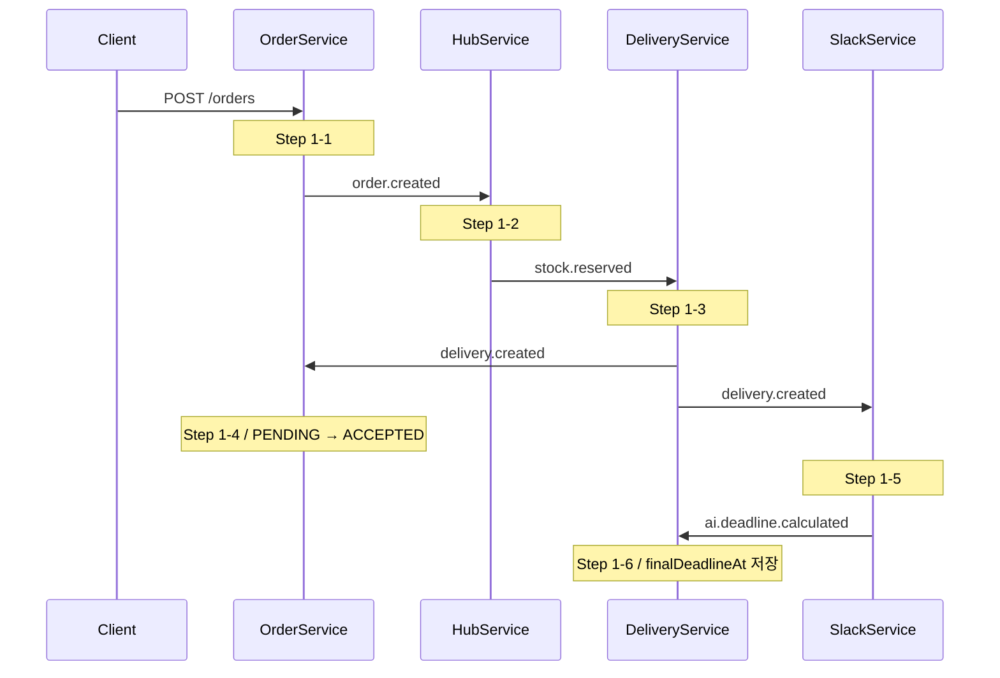
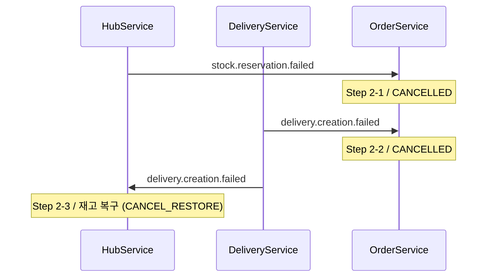
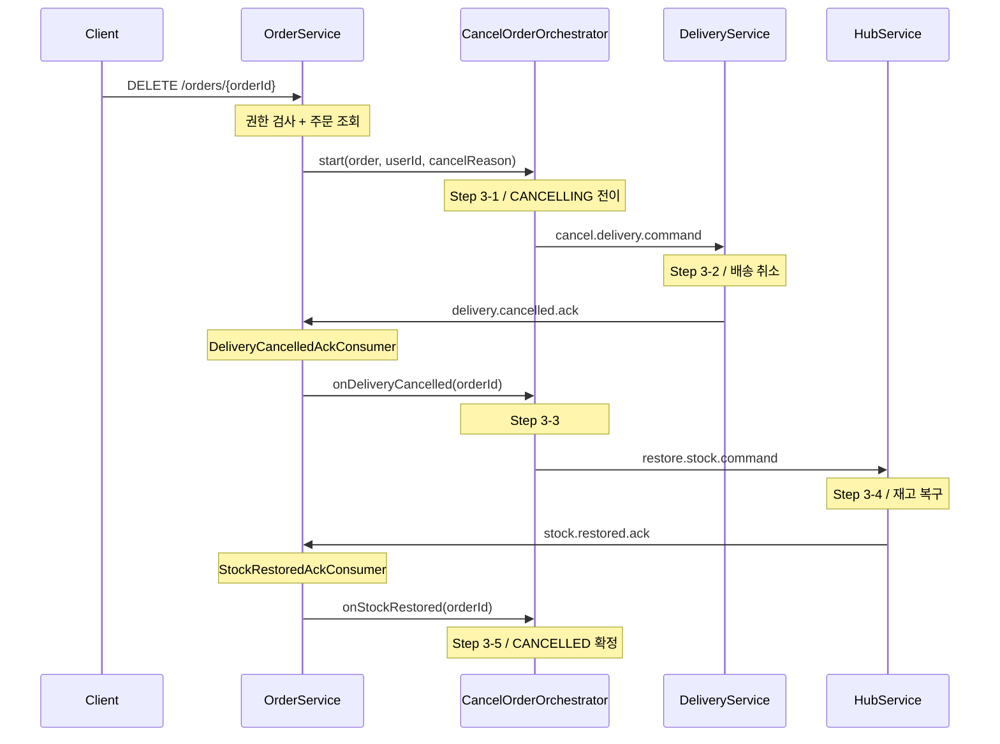
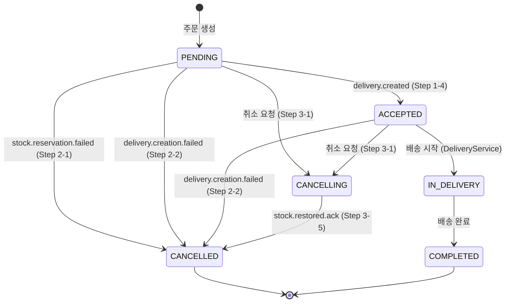

# Saga 가이드라인

두 가지 Saga 패턴을 Step 단위로 설명합니다.

- **주문 생성**: Choreography Saga (Kafka 이벤트 체이닝)
- **주문 취소**: Orchestration Saga (OrderService 내장 Orchestrator)

---

## 목차

1. [Kafka 토픽 전체 목록](#1-kafka-토픽-전체-목록)
2. [[Choreography Saga] 주문 생성](#2-choreography-saga--주문-생성)
3. [[Choreography Saga] 주문 생성 보상 트랜잭션](#3-choreography-saga--주문-생성-보상-트랜잭션)
4. [[Orchestration Saga] 주문 취소](#4-orchestration-saga--주문-취소)
5. [주문 상태 전이](#5-주문-상태-전이)

---

## 1. Kafka 토픽 전체 목록

| # | 토픽 | Publisher | Subscriber | 패턴 |
|---|---|---|---|---|
| 1 | `order.created` | OrderService | HubService | Choreography |
| 2 | `stock.reserved` | HubService | DeliveryService | Choreography |
| 3 | `stock.reservation.failed` | HubService | OrderService | Choreography 보상 |
| 4 | `delivery.created` | DeliveryService | OrderService, SlackService | Choreography |
| 5 | `delivery.creation.failed` | DeliveryService | HubService, OrderService | Choreography 보상 |
| 6 | `cancel.delivery.command` | OrderService (Orch.) | DeliveryService | Orchestration |
| 7 | `delivery.cancelled.ack` | DeliveryService | OrderService (Orch.) | Orchestration |
| 8 | `restore.stock.command` | OrderService (Orch.) | HubService | Orchestration |
| 9 | `stock.restored.ack` | HubService | OrderService (Orch.) | Orchestration |
| 10 | `hub.stock.updated` | HubService | OrderService | 스냅샷 동기화 |
| 11 | `ai.deadline.calculated` | SlackService | DeliveryService | Choreography |

- 토픽명 상수: `common/.../kafka/KafkaTopics.java`
- 메시지 DTO: `common/.../kafka/event/`

---

## 2. [Choreography Saga] 주문 생성

### [Step 1-1] `order.created` 발행

| 항목 | 내용 |
|---|---|
| 서비스 | **OrderService** |
| 진입점 | `OrderService.createOrder()` |
| 발행 토픽 | `order.created` |
| 파티션 키 | `orderId` |
| 처리 내용 | Order + OrderItem 생성(PENDING), `OrderCreatedEvent` 발행 |
| 이벤트 주요 필드 | `orderId`, `orderItems[]{productId, quantity, hubId}`, `requesterCompanyId`, `receiverCompanyId` |
| 다음 단계 | Step 1-2: HubService 재고 예약 |

### [Step 1-2] `order.created` 구독 → `stock.reserved` / `stock.reservation.failed` 발행

| 항목 | 내용 |
|---|---|
| 서비스 | **HubService** |
| 구독 토픽 | `order.created` |
| 처리 내용 | `orderItems` 순회하여 각 상품 재고 확인, 분산 락으로 `available` 차감 + `reserved` 증가 |
| 성공 시 발행 | `stock.reserved` (`orderId`, `destinationHubId`, `orderItems[]{productId, reservedQuantity, sourceHubId}`) |
| 실패 시 발행 | `stock.reservation.failed` (`orderId`, `productId`, `reason`) |
| 파티션 키 | `orderId` |
| 다음 단계 (성공) | Step 1-3: DeliveryService 배송 생성 |
| 다음 단계 (실패) | Step 2-1: OrderService 보상 취소 |

### [Step 1-3] `stock.reserved` 구독 → `delivery.created` / `delivery.creation.failed` 발행

| 항목 | 내용 |
|---|---|
| 서비스 | **DeliveryService** |
| 구독 토픽 | `stock.reserved` |
| 처리 내용 | Hub Route 조회, `Delivery` + `DeliveryRoute` 생성, 배송 담당자 배정(미배정 시 null 허용) |
| 성공 시 발행 | `delivery.created` (`deliveryId`, `orderId`, `sourceHubId`, `destinationHubId`, `companyDeliveryManagerId`) |
| 실패 시 발행 | `delivery.creation.failed` (`orderId`, `deliveryId`, `reason`) |
| 파티션 키 | `deliveryId` (성공) / `orderId` (실패) |
| 다음 단계 (성공) | Step 1-4: OrderService ACCEPTED 전이, Step 1-5: SlackService AI 시한 계산 |
| 다음 단계 (실패) | Step 2-2: OrderService 보상 취소, Step 2-3: HubService 재고 복구 |

### [Step 1-4] `delivery.created` 구독 → 주문 ACCEPTED 전이

| 항목 | 내용 |
|---|---|
| 서비스 | **OrderService** |
| 컨슈머 | `DeliveryCreatedConsumer` |
| 구독 토픽 | `delivery.created` |
| 위임 메서드 | `OrderService.acceptOrder()` |
| 처리 내용 | 주문 상태 PENDING → ACCEPTED, `deliveryId` 저장 |
| 멱등성 | PENDING이 아닌 경우 no-op |

### [Step 1-5] `delivery.created` 구독 → AI 발송 시한 계산 → `ai.deadline.calculated` 발행

| 항목 | 내용 |
|---|---|
| 서비스 | **SlackService (NotificationService)** |
| 구독 토픽 | `delivery.created` |
| 처리 내용 | AI API 호출로 `finalDeadlineAt` 산출, Slack 알림 발송 |
| 발행 토픽 | `ai.deadline.calculated` (`deliveryId`, `orderId`, `finalDeadlineAt`) |
| 파티션 키 | `deliveryId` |
| 다음 단계 | Step 1-6: DeliveryService `finalDeadlineAt` 저장 |

### [Step 1-6] `ai.deadline.calculated` 구독 → `finalDeadlineAt` 저장

| 항목 | 내용 |
|---|---|
| 서비스 | **DeliveryService** |
| 구독 토픽 | `ai.deadline.calculated` |
| 처리 내용 | 해당 Delivery에 `finalDeadlineAt` 저장 |
| 파티션 키 | `deliveryId` |

---

## 3. [Choreography Saga] 주문 생성 보상 트랜잭션

### [Step 2-1] `stock.reservation.failed` 구독 → 주문 CANCELLED

| 항목 | 내용 |
|---|---|
| 서비스 | **OrderService** |
| 컨슈머 | `StockReservationFailedConsumer` |
| 구독 토픽 | `stock.reservation.failed` |
| 위임 메서드 | `OrderService.cancelOrderByCompensation()` |
| 처리 내용 | 주문 즉시 CANCELLED, `cancelReason` = 실패 사유 |
| 멱등성 | 이미 CANCELLED인 경우 no-op |

### [Step 2-2] `delivery.creation.failed` 구독 → 주문 CANCELLED

| 항목 | 내용 |
|---|---|
| 서비스 | **OrderService** |
| 컨슈머 | `DeliveryCreationFailedConsumer` |
| 구독 토픽 | `delivery.creation.failed` |
| 위임 메서드 | `OrderService.cancelOrderByCompensation()` |
| 처리 내용 | 주문 즉시 CANCELLED, `cancelReason` = 실패 사유 |
| 멱등성 | 이미 CANCELLED인 경우 no-op |

### [Step 2-3] `delivery.creation.failed` 구독 → 재고 예약 복구

| 항목 | 내용 |
|---|---|
| 서비스 | **HubService** |
| 구독 토픽 | `delivery.creation.failed` |
| 처리 내용 | `releaseReservation()` 호출로 `reserved` 차감 + `available` 복구, `HubStockChangeType.CANCEL_RESTORE` 이력 기록 |
| 비고 | Step 2-2와 동일 토픽을 독립적으로 구독 (각 서비스가 자율적으로 보상) |

---

## 4. [Orchestration Saga] 주문 취소

`CancelOrderOrchestrator`가 중앙에서 커맨드를 발행하고 ACK를 수신하며 취소 흐름을 조율합니다.

### CancelOrderOrchestrator 클래스

| 항목 | 내용 |
|---|---|
| 역할 | Orchestration Saga 중앙 조율자. Step 3-1/3-3/3-5에서 커맨드 발행 및 상태 전이를 담당 |
| 의존성 | `OrderRepository`, `KafkaTemplate` |
| 메서드 | `start(Order, UUID, String)` / `onDeliveryCancelled(UUID)` / `onStockRestored(UUID)` |
| 트랜잭션 | 메서드별 `@Transactional` (각 단계 독립 트랜잭션) |
| 멱등성 전략 | 주문 없음 → warn 후 no-op / CANCELLING 아님 → warn 후 no-op |
| 커맨드 식별 | 발행 시 `eventId = UUID.randomUUID()` 부여 |
| 파티션 키 | 모든 발행에 `orderId` 사용 → 동일 주문의 명령 순서 보장 |

### [Step 3-1] `cancel.delivery.command` 발행

| 항목 | 내용 |
|---|---|
| 서비스 | **OrderService** |
| 담당 컴포넌트 | `CancelOrderOrchestrator.start()` |
| 진입점 | `OrderService.cancelOrder()` → `CancelOrderOrchestrator.start()` |
| 발행 토픽 | `cancel.delivery.command` |
| 파티션 키 | `orderId` |
| 처리 내용 | 주문 상태 → CANCELLING, `cancelledBy`·`cancelReason` 기록, 커맨드 발행 |
| 이벤트 주요 필드 | `orderId`, `deliveryId` |
| 전이 가능 상태 | PENDING, ACCEPTED (IN_DELIVERY 이상은 `ORDER_NOT_CANCELLABLE` 예외) |
| 권한 검사 | `OrderService.cancelOrder()`에서 MASTER·HUB_MANAGER 여부 및 허브 담당 검사 후 위임 |
| 다음 단계 | Step 3-2: DeliveryService 배송 취소 |

### [Step 3-2] `cancel.delivery.command` 구독 → `delivery.cancelled.ack` 발행

| 항목 | 내용 |
|---|---|
| 서비스 | **DeliveryService** |
| 구독 토픽 | `cancel.delivery.command` |
| 처리 내용 | 배송 상태 확인 후 취소 처리 (`PENDING`/`ACCEPTED` → 취소 가능, `IN_TRANSIT` 이상 → 취소 불가) |
| 성공 시 발행 | `delivery.cancelled.ack` (`deliveryId`, `orderId`) |
| 파티션 키 | `orderId` |
| 다음 단계 | Step 3-3: OrderService `restore.stock.command` 발행 |

### [Step 3-3] `delivery.cancelled.ack` 구독 → `restore.stock.command` 발행

| 항목 | 내용 |
|---|---|
| 서비스 | **OrderService** |
| 담당 컴포넌트 | `CancelOrderOrchestrator.onDeliveryCancelled()` |
| 컨슈머 | `DeliveryCancelledAckConsumer` |
| 구독 토픽 | `delivery.cancelled.ack` |
| 위임 메서드 | `OrderService.handleDeliveryCancelled()` → `CancelOrderOrchestrator.onDeliveryCancelled()` |
| 발행 토픽 | `restore.stock.command` |
| 파티션 키 | `orderId` |
| 처리 내용 | `OrderItem` 목록으로 복구 대상 상품·수량 구성 후 재고 복구 커맨드 발행 |
| 이벤트 주요 필드 | `orderId`, `orderItems[]{productId, quantity}` |
| 멱등성 | CANCELLING이 아닌 경우 no-op |
| 다음 단계 | Step 3-4: HubService 재고 복구 |

### [Step 3-4] `restore.stock.command` 구독 → `stock.restored.ack` 발행

| 항목 | 내용 |
|---|---|
| 서비스 | **HubService** |
| 구독 토픽 | `restore.stock.command` |
| 처리 내용 | `orderItems` 순회하여 각 상품 `reserved` 차감 + `available` 복구, `HubStockChangeType.CANCEL_RESTORE` 이력 기록 |
| 발행 토픽 | `stock.restored.ack` (`orderId`) |
| 파티션 키 | `orderId` |
| 다음 단계 | Step 3-5: OrderService CANCELLED 확정 |

### [Step 3-5] `stock.restored.ack` 구독 → 주문 CANCELLED 확정

| 항목 | 내용 |
|---|---|
| 서비스 | **OrderService** |
| 담당 컴포넌트 | `CancelOrderOrchestrator.onStockRestored()` |
| 컨슈머 | `StockRestoredAckConsumer` |
| 구독 토픽 | `stock.restored.ack` |
| 위임 메서드 | `OrderService.confirmOrderCancelled()` → `CancelOrderOrchestrator.onStockRestored()` |
| 처리 내용 | 주문 상태 CANCELLING → CANCELLED, `cancelledAt` 기록 |
| 멱등성 | CANCELLING이 아닌 경우 no-op |
| 비고 | `cancelledBy`·`cancelReason`은 Step 3-1에서 이미 저장되어 있으므로 재기록하지 않음 |

---

## 5. 주문 상태 전이

| 현재 상태 | 전이 후 상태 | 조건 |
|---|---|---|
| `PENDING` | `ACCEPTED` | `delivery.created` 수신 (Step 1-4) |
| `PENDING` | `CANCELLED` | `stock.reservation.failed` 수신 (Step 2-1) |
| `PENDING` | `CANCELLED` | `delivery.creation.failed` 수신 (Step 2-2) |
| `PENDING` | `CANCELLING` | 취소 요청 (MASTER·HUB_MANAGER, Step 3-1) |
| `ACCEPTED` | `IN_DELIVERY` | 배송 시작 (DeliveryService 외부 이벤트) |
| `ACCEPTED` | `CANCELLED` | `delivery.creation.failed` 수신 (Step 2-2) |
| `ACCEPTED` | `CANCELLING` | 취소 요청 (MASTER·HUB_MANAGER, Step 3-1) |
| `CANCELLING` | `CANCELLED` | `stock.restored.ack` 수신 (Step 3-5) |
| `IN_DELIVERY` 이상 | 취소 불가 | `ORDER_NOT_CANCELLABLE` 예외 |

※ `CANCELLING` 중에는 수정 불가(`isModifiable()` = false)