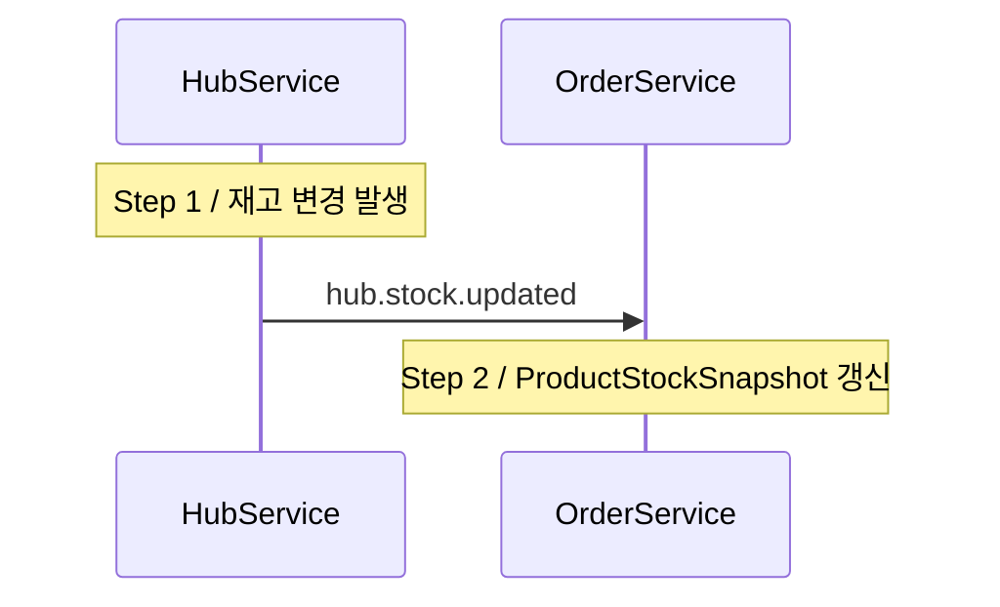

# 재고 스냅샷 동기화

Order Service는 주문 생성 시 재고 가용량을 빠르게 확인하기 위해 Hub Service의 재고 데이터를 `ProductStockSnapshot`으로 로컬 캐시합니다.
Hub Service에서 재고 변경이 발생할 때마다 `hub.stock.updated` 이벤트를 발행하고, Order Service가 이를 구독하여 스냅샷을 갱신합니다.

---

## 목차

1. [동기화 흐름](#1-동기화-흐름)
2. [[Step 1] HubService: `hub.stock.updated` 발행](#2-step-4-1-hubservice-hubstockupdated-발행)
3. [[Step 2] OrderService: `ProductStockSnapshot` 갱신](#3-step-4-2-orderservice-productstocksnapshot-갱신)
4. [엔티티: ProductStockSnapshot](#4-엔티티-productstocksnapshot)
5. [멱등성 보장 전략](#5-멱등성-보장-전략)

---

## 1. 동기화 흐름

Saga 패턴이 아니므로 보상 트랜잭션이 존재하지 않으며, 멱등성은 `hubStockVersion` 비교로 보장합니다.

---

## 2. [Step 1] HubService: `hub.stock.updated` 발행

| 항목 | 내용 |
|---|---|
| 서비스 | **HubService** |
| 발행 시점 | 재고 변경(`adjust()`) 처리 후 |
| 발행 토픽 | `hub.stock.updated` |
| 파티션 키 | `productId` (동일 상품의 이벤트 순서 보장) |
| 이벤트 주요 필드 | `productId`, `hubId`, `available`, `hubStockVersion` |

## 3. [Step 2] OrderService: `ProductStockSnapshot` 갱신

| 항목 | 내용 |
|---|---|
| 서비스 | **OrderService** |
| 컨슈머 | `HubStockUpdatedConsumer` |
| 구독 토픽 | `hub.stock.updated` |
| 위임 메서드 | `OrderService.syncSnapshot()` |
| 처리 내용 (기존 스냅샷) | `hubStockVersion` 비교 후 신규 버전이면 `available` 갱신 |
| 처리 내용 (신규 상품) | 스냅샷이 없으면 `ProductStockSnapshot.create()`로 새로 생성 |
| 멱등성 | 저장된 `hubStockVersion`보다 낮거나 같은 이벤트는 구버전으로 간주하고 무시 |

---

## 4. 엔티티: ProductStockSnapshot

테이블: `p_product_stock_snapshot`

| 필드 | 타입 | 설명 |
|---|---|---|
| `id` | `UUID` | PK |
| `productId` | `UUID` | UNIQUE. 상품 ID |
| `hubId` | `UUID` | 상품이 속한 허브 ID |
| `available` | `Integer` | 현재 가용 재고 수량 |
| `hubStockVersion` | `Long` | HubService 재고 버전. 구버전 이벤트 무시에 사용 |
| `syncedAt` | `LocalDateTime` | 마지막 동기화 시각 |

**주요 메서드**

| 메서드 | 설명 |
|---|---|
| `create(productId, hubId, available, hubStockVersion)` | 신규 스냅샷 생성 |
| `update(available, hubStockVersion)` | 가용 재고와 버전 갱신, `syncedAt` 갱신 |

---

## 5. 멱등성 보장 전략

`hub.stock.updated` 이벤트는 Kafka At-Least-Once로 재전송될 수 있습니다.

`OrderService.syncSnapshot()`은 이벤트의 `hubStockVersion`을 스냅샷의 `hubStockVersion`과 비교하여
저장된 버전 이상의 이벤트만 처리하고 그 외는 무시합니다.

파티션 키를 `productId`로 고정하여 동일 상품의 이벤트가 동일 파티션에서 순서 처리되도록 보장합니다.
